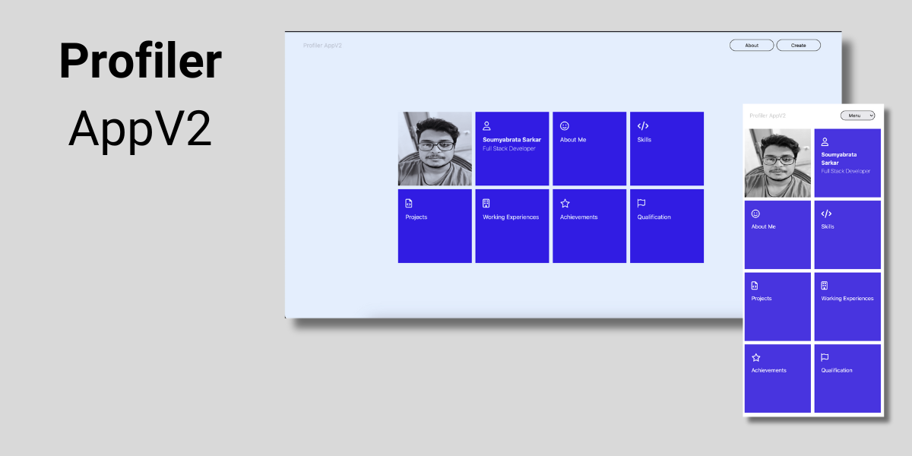
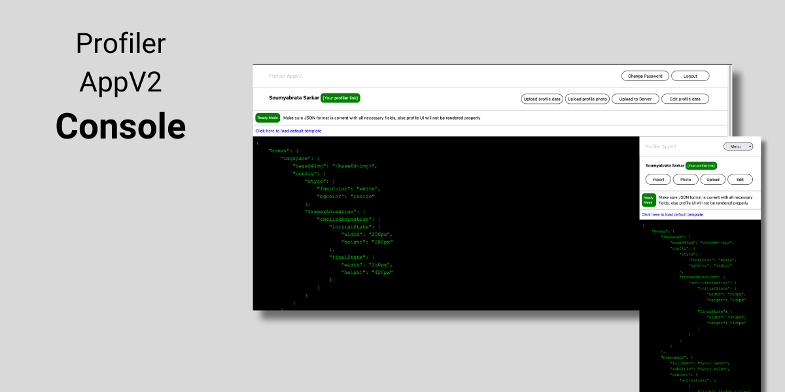

# Profiler AppV2

<div style="display: flex;  flex-direction: row">
    <div style="display: flex; flex: 3; flex-direction: column">
        <div style="flex: 1;">
            
        </div>
        <div style="flex: 1;">
            
        </div>
    </div>
</div>

Profiler AppV2 is a web application that allows users to create and manage their profiles with ease. The application utilizes modern web technologies, including Tailwind CSS, Framer Animation, JWT authentication, and other features to enhance user experience.

## Features

### User Profiles

- Users can easily create and manage their profiles by updating a single JSON file with their information.
- Profile details are displayed in an animated tile format, providing an engaging and visually appealing user interface.

### Customizable Themes

- Users have the flexibility to customize each tile's theme by updating a JSON file, allowing for a personalized and visually pleasing experience.

### Admin Panel

- The application includes an admin panel that enables administrators to upload pre-filled data.
- Administrators can also load templates into the app, allowing users to edit and customize their profiles based on predefined structures.

### Technical Implementation

- **JWT Authentication:** Ensures secure authentication for users accessing the application.
- **Bcrypt.js:** Used for password hashing to enhance security.
- **In-browser JSON Editing:** Allows users to edit their profile information conveniently within the application.
- **JsonSchema validator:** Validating profile json payload before sending to server to upload.
- **Payload handler:** The application is optimized to handle big payloads efficiently during HTTP calls, ensuring a smooth user experience even with large amounts of data.
- **Image Store:** Images are stored in base64 format, providing a convenient way to handle image data within the application.
- **Password Regenarate and Send in Mail:** On reset password, password can be reset and will receive newly generated password on mail
- **Tailwind CSS:** A utility-first CSS framework for building modern web designs with minimal effort.
- **Framer Animation:** Utilized for creating smooth and engaging animations within the application.

## Getting Started

1. **Clone the repository:**

   ```bash
   git clone https://github.com/your-username/profiler-appv2.git
   ```

2. **Install dependencies:**

   ```bash
   cd profiler-appv2
   npm install
   ```

3. **Set up the necessary configurations, including JWT secrets, database connections, etc.**

4. **Run the application:**

   ```bash
   npm start
   ```

Visit `http://localhost:3000` in your browser to access the Profiler AppV2.

Feel free to reach out for any questions or issues!
